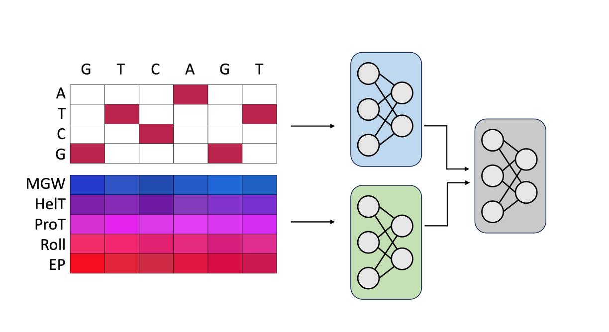

# DeepShape



bioRxiv pre-print [here] (https://www.biorxiv.org/content/10.1101/2025.04.01.646034v1)

DeepShape is a deep convolutional neural network designed to predict molecular phenotypes from DNA sequences. Unlike traditional models that rely solely on one-hot encoded DNA sequences, DeepShape integrates DNA structural attributes indicative of local shape: minor groove width (MGW), helical twist (HelT), propeller twist (ProT), roll, and electrostatic potential (EP). This combination enhances the interpretability of the model and helps identify regulatory patterns that are not apparent from sequence information alone.

DeepShape is built upon DeeperDeepSEA, a PyTorch-based deep learning model originally designed to predict chromatin features from DNA sequence alone as implemented in [Selene](https://www.nature.com/articles/s41592-019-0360-8).

## Setup

The `environment.yaml` file provided in this repository contains the dependencies required to run DeepShape. 

Create the new conda environment:
```bash
conda env create -f environment.yaml
```
Activate the conda environment:
```bash
conda activate dnashapeenv
```

Once the environment is activated, you will be ready to run DeepShape with all necessary dependencies installed.

## Running DeepShape

The `utils` directory holds essential scripts and helper files needed to run DeepShape. Ensure the following are present in `utils`:

- `run_deepshape.py`: The main script to run DeepShape.
- `shape_fasta.py`: A helper script for processing FASTA files.
- `genome_shape_hdf5`: Directory containing helper scripts for processing genome shape data.
- `intervals_sampler_hdf5`: Directory containing helper scripts for sampling.

The `model` directory contains the DeepShape model implementation:

- `deepshape.py`

### Prepare the Configuration File

Ensure your configuration file is prepared, including all necessary parameters and paths. An example is available in `config`.

### Run the DeepShape Model

To run the DeepShape model using the `run_deepshape.py` script, execute the following command in your terminal:

```bash
python utils/run_deepshape.py /ABSOLUTE/PATH/config/train_deepshape.yml
```


